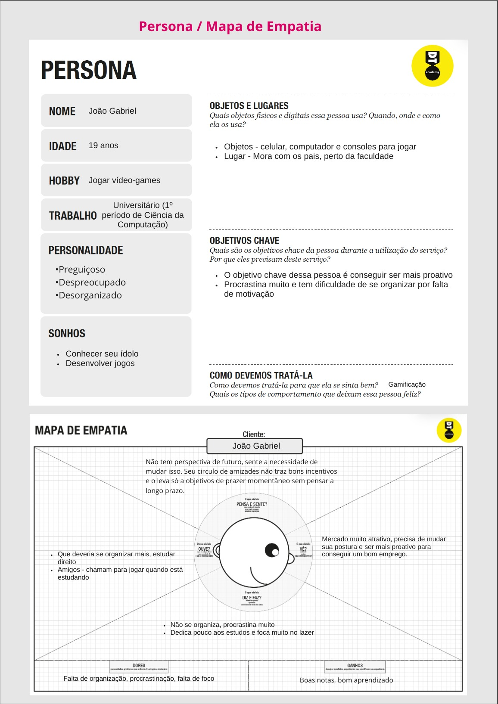
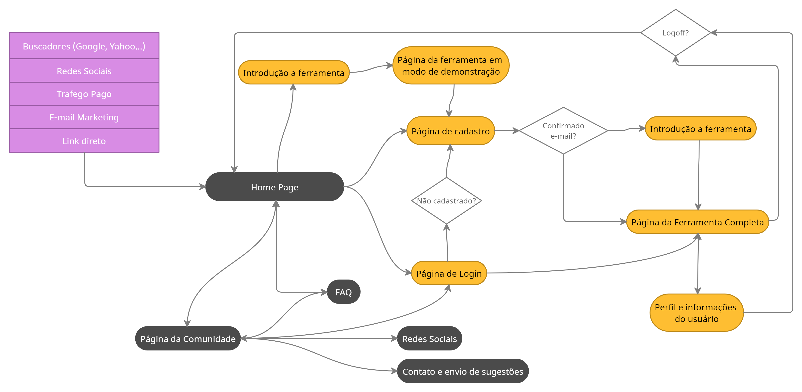
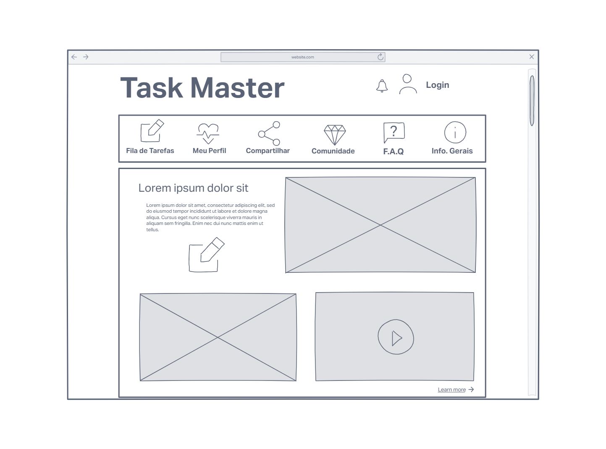
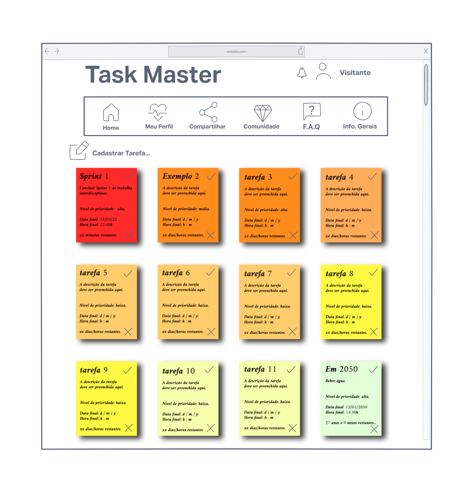

# Informações do Projeto
`TÍTULO DO PROJETO`  

Task Master

`CURSO` 

Ciência da Computação

## Participantes

Os membros do grupo são: 
- Bernardo Marques Fernandes
- Carolina Morais Nigri
- Gabriel Praes Bernardes Nunes
- Igor Vilela Nunes da Rocha Godinho
- Ivan Pereira Reis Nascimento
- João Paulo Leao Matos
- Saulo de Moura Zandona Freitas

# Estrutura do Documento

- [Informações do Projeto](#informações-do-projeto)
  - [Participantes](#participantes)
- [Estrutura do Documento](#estrutura-do-documento)
- [Introdução](#introdução)
  - [Problema](#problema)
  - [Objetivos](#objetivos)
  - [Justificativa](#justificativa)
  - [Público-Alvo](#público-alvo)
- [Especificações do Projeto](#especificações-do-projeto)
  - [Personas e Mapas de Empatia](#personas-e-mapas-de-empatia)
  - [Histórias de Usuários](#histórias-de-usuários)
  - [Requisitos](#requisitos)
    - [Requisitos Funcionais](#requisitos-funcionais)
    - [Requisitos não Funcionais](#requisitos-não-funcionais)
  - [Restrições](#restrições)
- [Projeto de Interface](#projeto-de-interface)
  - [User Flow](#user-flow)
  - [Wireframes](#wireframes)
- [Metodologia](#metodologia)
  - [Divisão de Papéis](#divisão-de-papéis)
  - [Ferramentas](#ferramentas)
  - [Controle de Versão](#controle-de-versão)
- [**############## SPRINT 1 ACABA AQUI #############**](#-sprint-1-acaba-aqui-)
- [Projeto da Solução](#projeto-da-solução)
  - [Tecnologias Utilizadas](#tecnologias-utilizadas)
  - [Arquitetura da solução](#arquitetura-da-solução)
- [Avaliação da Aplicação](#avaliação-da-aplicação)
  - [Plano de Testes](#plano-de-testes)
  - [Ferramentas de Testes (Opcional)](#ferramentas-de-testes-opcional)
  - [Registros de Testes](#registros-de-testes)
- [Referências](#referências)

# Introdução

## Problema

A procrastinação é um grande problema que envolve uma quantidade enorme de pessoas, trata-se do ato de protelar/adiar, onde, muitas vezes, envolve tarefas muito importantes que acabam sendo abandonadas, como um trabalho importante de escola, ou uma tarefa bem requisitada no trabalho. O ato de procrastinar é natural do ser humano, mas ao longo do tempo, esse problema tem se agravado bastante graças ao fácil acesso a distrações, como as redes sociais (que costumam gastar grande parte do tempo das pessoas), séries, filmes, jogos... Além do problema da distração, a falta de organização e planejamento também contribuem muito para que atividades importantes acabem ficando para trás, principalmente no caso de pessoas que tem um tempo restrito para fazer muitas coisas. 

> Nesse momento você deve apresentar o problema que a sua aplicação deve
> resolver. No entanto, não é a hora de comentar sobre a aplicação.
> Descreva também o contexto em que essa aplicação será usada, se
> houver: empresa, tecnologias, etc. Novamente, descreva apenas o que de
> fato existir, pois ainda não é a hora de apresentar requisitos
> detalhados ou projetos.
>
> Nesse momento, o grupo pode optar por fazer uso
> de ferramentas como Design Thinking, que permite um olhar de ponta a
> ponta para o problema.
>
> **Links Úteis**:
> - [Objetivos, Problema de pesquisa e Justificativa](https://medium.com/@versioparole/objetivos-problema-de-pesquisa-e-justificativa-c98c8233b9c3)
> - [Matriz Certezas, Suposições e Dúvidas](https://medium.com/educa%C3%A7%C3%A3o-fora-da-caixa/matriz-certezas-suposi%C3%A7%C3%B5es-e-d%C3%BAvidas-fa2263633655)
> - [Brainstorming](https://www.euax.com.br/2018/09/brainstorming/)

## Objetivos

Nosso objetivo nesse trabalho é ajudar a população que sofre desse problema a se organizar melhor, a se manter motivado a cumprir suas tarefas e a ter um planejamento, como um cronograma semanal ou uma agenda de compromissos interativa, para que assim, essa pessoa possa entender melhor o que fazer, como/quando fazer e ser mais produtiva, conseguindo até mesmo fazer um número de atividades maior em menos tempo.

Tendo isso em vista, o objetivo geral deste projeto é desenvolver uma aplicação Web que auxilie o usuário a se organizar e evitar a procrastinação. Já os objetivos específicos são:
- Fazer com que a tecnologia (computador, celular ou tablet) seja uma forma de resolver o problema da procrastinação, ao invés de ser uma causa dela
- Fornecer uma plataforma de fácil e rápido uso para que o ato de se planejar não se torne uma tarefa que consuma muito tempo e energia do usuário
- Auxiliar, em especial, estudantes universitários a registrarem suas tarefas e cumprirem seus prazos de entrega

> Aqui você deve descrever os objetivos do trabalho indicando que o
> objetivo geral é desenvolver um software para solucionar o problema
> apresentado acima. Apresente também alguns (pelo menos 2) objetivos
> específicos dependendo de onde você vai querer concentrar a sua
> prática investigativa, ou como você vai aprofundar no seu trabalho.
> 
> **Links Úteis**:
> - [Objetivo geral e objetivo específico: como fazer e quais verbos utilizar](https://blog.mettzer.com/diferenca-entre-objetivo-geral-e-objetivo-especifico/)

## Justificativa

Planejamento e organização são elementos de alta importância na vida humana, especialmente no mundo atual, em que temos uma série de deveres a cumprir para com a sociedade e com nós mesmos, o que nem sempre é alcançado da melhor e mais completa forma. Levando isso em conta, este projeto busca tornar esses elementos mais presentes na vida e rotina daqueles que utilizarem esta aplicação, facilitando a tarefa de fazer planejamentos e se organizar, de forma a tornar isso um hábito e evitar a procrastinação. 

Segundo reportagem publicada na revista Super Interessante, estudos mostram que 20% dos adultos são procrastinadores crônicos, dado que representa, somente no Brasil, cerca de 20 milhões de pessoas. Nesse sentido, consideramos que o jovem adulto, especialmente os estudantes universitários, está entre aqueles que mais procrastinam e sente essa dificuldade em se organizar, visto que este é um público que tem diversas tarefas acadêmicas a realizar e, ao mesmo tempo, quer aproveitar esse período da vida enquanto jovem, sendo, portanto, um bom público a quem se destinar este projeto. 

> Descreva a importância ou a motivação para trabalhar com esta aplicação
> que você escolheu. Indique as razões pelas quais você escolheu seus
> objetivos específicos ou as razões para aprofundar em certos aspectos
> do software.
> 
> O grupo de trabalho pode fazer uso de questionários, entrevistas e
> dados estatísticos, que podem ser apresentados, com o objetivo de
> esclarecer detalhes do problema que será abordado pelo grupo.
>
> **Links Úteis**:
> - [Como montar a justificativa](https://guiadamonografia.com.br/como-montar-justificativa-do-tcc/)

## Público-Alvo

O público-alvo é, principalmente, estudantes universitários que tem dificuldade de se organizar e manter uma disciplina e estudantes que além de estudar trabalham, necessitando de uma organização melhor do tempo para conseguir realizar todas as suas tarefas. Dividindo o público-alvo trabalhado nesses dois grupos, busca-se observar como eles lidam com a organização e a procrastinação em suas vidas, considerando que, provavelmente, a falta de tempo daqueles que trabalham possa afetar mais sua rotina enquanto outras causas possíveis sejam impedimentos para aqueles que apenas estudam. Observadas as causas e analisando as diferentes rotinas desse público, busca-se oferecer ferramentas que se adequem às diferentes necessidades desses usuários.

> Descreva quem serão as pessoas que usarão a sua aplicação indicando os
> diferentes perfis. O objetivo aqui não é definir quem serão os
> clientes ou quais serão os papéis dos usuários na aplicação. A ideia
> é, dentro do possível, conhecer um pouco mais sobre o perfil dos
> usuários: conhecimentos prévios, relação com a tecnologia, relações
> hierárquicas, etc.
>
> Adicione informações sobre o público-alvo por meio de uma descrição
> textual, ou diagramas de personas, mapa de stakeholders, ou como o
> grupo achar mais conveniente.
> 
> **Links Úteis**:
> - [Público-alvo: o que é, tipos, como definir seu público e exemplos](https://klickpages.com.br/blog/publico-alvo-o-que-e/)
> - [Qual a diferença entre público-alvo e persona?](https://rockcontent.com/blog/diferenca-publico-alvo-e-persona/)
 
# Especificações do Projeto

Para a construção do projeto, passou-se por um processo de entendimento e exploração do problema, criando duas personas que representem grupos diferentes dentro do público-alvo escolhido, pensando nas suas necessidades humanas e enquanto usuários. Por fim, enumerou-se os requisitos da aplicação, funcionais e não funcionais, além de restrições para o seu desenvolvimento.

> Apresente uma visão geral do que será abordado nesta parte do
> documento, enumerando as técnicas e/ou ferramentas utilizadas para
> realizar a especificações do projeto

## Personas e Mapas de Empatia

As personas criadas durante o processo de Design Thinking são apresentadas abaixo:

> Relacione as personas identificadas no seu projeto e os respectivos mapas de empatia. Lembre-se que 
> você deve ser enumerar e descrever precisamente e de forma
> personalizada todos os principais envolvidos com a solução almeja. 
> 
> Para tanto, baseie-se tanto nos documentos disponibilizados na disciplina
> e/ou nos seguintes links:
>
> **Links Úteis**:
> - [Persona x Público-alvo](https://flammo.com.br/blog/persona-e-publico-alvo-qual-a-diferenca/)
> - [O que é persona?](https://resultadosdigitais.com.br/blog/persona-o-que-e/)
> - [Rock Content](https://rockcontent.com/blog/personas/)
> - [Hotmart](https://blog.hotmart.com/pt-br/como-criar-persona-negocio/)
> - [Mapa de Empatia](https://resultadosdigitais.com.br/blog/mapa-da-empatia/)
> - [Como fazer um mapa de empatia - Vídeo](https://www.youtube.com/watch?v=JlKHGpVoA2Y)
> 
> 
> **Exemplo de Persona**
> 
> 
> 
> Fonte: [Como criar uma persona para o seu negócio](https://raissaviegas.com.br/como-criar-uma-persona/)

## Histórias de Usuários

Com base na análise das personas, foram identificadas as seguintes histórias de usuários:

|EU COMO... `PERSONA`| QUERO/PRECISO ... `FUNCIONALIDADE` |PARA ... `MOTIVO/VALOR`                 |
|--------------------|------------------------------------|----------------------------------------|
|João Gabriel  | Anotar meus afazeres           | Deixar tudo organizado               |
|João Gabriel  | Organizar minhas tarefas em ordem de importância           | Saber qual que eu tenho de fazer primeiro e quais eu posso deixar para mais tarde               |
|João Gabriel  | Colocar alarmes na hora das atividades           | Seguir os horários e acabar com a procrastinação               |
|João Gabriel  | Ser motivado de alguma forma           | Ter um motivo a mais para eu me organizar               |
|Rafaela       | Registrar minha rotina                 | Me manter organizada |
|Rafaela       | Ter tudo no meu celular                 | Saber o que eu tenho que fazer de forma rápida, sem ter que ligar o computador, porque o celular está sempre comigo |
|Rafaela       | Fazer anotações em cada compromisso                 | Me organizar de uma forma mais precisa |

## Requisitos

As tabelas que se seguem apresentam os requisitos funcionais e não funcionais que detalham o escopo do projeto.

### Requisitos Funcionais

|ID    | Descrição do Requisito  | Prioridade |
|------|-----------------------------------------|----|
|RF-001| Possuir uma tela de login. | ALTA | 
|RF-002| Possuir um sistema de recompensas. | MÉDIA |
|RF-003| Ter um menu inicial com opções de navegacao. | ALTA |
|RF-004| O site deve permitir que o usuário acesse um menu com suas tarefas. | ALTA |
|RF-005| Permitir que o usuário veja e edite suas informações de perfil. | MÉDIA |
|RF-006| Permitir compartilhamento de informações em redes sociais. | BAIXA |
|RF-007| Possuir uma página de comunidade. | BAIXA |
|RF-008| Possuir uma tela de FAQ. | BAIXA |
|RF-009| Permitir acessar informações gerais sobre o site. | MÉDIA |
|RF-010| Permitir configurar notificações. | ALTA |

### Requisitos não Funcionais

|ID     | Descrição do Requisito  |Prioridade |
|-------|-------------------------|----|
|RNF-001| O sistema deve ser responsivo para rodar em um dispositivos móvel | MÉDIA | 
|RNF-002| O site deve ser fácil de navegar. | ALTA | 
|RNF-003| Ser publicado em ambientes de fácil acesso na internet. | ALTA |  
|RNF-004| Ser compatível com os principais navegadores. | ALTA |
|RNF-005| Processar requisitos do usuário em menos de 3s. | BAIXA |

> Com base nas Histórias de Usuário, enumere os requisitos da sua
> solução. Classifique esses requisitos em dois grupos:
>
> - [Requisitos Funcionais (RF)](https://pt.wikipedia.org/wiki/Requisito_funcional):
>   correspondem a uma funcionalidade que deve estar presente na
>   plataforma (ex: cadastro de usuário).
>
> - [Requisitos Não Funcionais (RNF)](https://pt.wikipedia.org/wiki/Requisito_n%C3%A3o_funcional):
>   correspondem a uma característica técnica, seja de usabilidade,
>   desempenho, confiabilidade, segurança ou outro (ex: suporte a
>   dispositivos iOS e Android).
>
> Lembre-se que cada requisito deve corresponder à uma e somente uma
> característica alvo da sua solução. Além disso, certifique-se de que
> todos os aspectos capturados nas Histórias de Usuário foram cobertos.
> 
> **Links Úteis**:
> 
> - [O que são Requisitos Funcionais e Requisitos Não Funcionais?](https://codificar.com.br/requisitos-funcionais-nao-funcionais/)
> - [O que são requisitos funcionais e requisitos não funcionais?](https://analisederequisitos.com.br/requisitos-funcionais-e-requisitos-nao-funcionais-o-que-sao/)

## Restrições

O projeto está restrito pelos itens apresentados na tabela a seguir.

|ID| Restrição                                                                         |
|--|-----------------------------------------------------------------------------------|
|01| O projeto deverá ser entregue até o final do semestre                             |
|02| Não pode ser desenvolvido um módulo de backend                                    |
|03| Devemos ter uma evolução individual semanal en relação ao projeto                 |
|04| O projeto deve ter um foco inicial em ajudar os estudantes que procastinam        |
|05| A equipe não pode subcontratar o desenvolvimento do trabalho                      |
|06| Não podemos ultrapassar os prazos de entrega dos sprints no canvas                |
|07| Inicialmente o projeto deve ser feito em HMTL, CSS e JS                           |
|08| A aplicação deve ser simples e de fácil acesso para o usuário                     |

> Enumere as restrições à sua solução. Lembre-se de que as restrições
> geralmente limitam a solução candidata.
> 
> **Links Úteis**:
> - [O que são Requisitos Funcionais e Requisitos Não Funcionais?](https://codificar.com.br/requisitos-funcionais-nao-funcionais/)
> - [O que são requisitos funcionais e requisitos não funcionais?](https://analisederequisitos.com.br/requisitos-funcionais-e-requisitos-nao-funcionais-o-que-sao/)

# Projeto de Interface

A interface da aplicação foi construída de forma a atender à necessidade dos usuários de se registrar as tarefas a serem cumpridas, organizando-as de acordo com seus respectivos prazos e níveis de prioridades. Para tanto, a página permite ao usuário cadastrar seu perfil e acompanhar sua fila de tarefas, além de possibilitar uma integração com a comunidade, FAQ e compartilhamento em redes sociais.

> Apresente as principais interfaces da solução. Discuta como 
> foram elaboradas de forma a atender os requisitos funcionais, não
> funcionais e histórias de usuário abordados nas [Especificações do
> Projeto](#especificações-do-projeto).

## User Flow

O diagrama abaixo apresenta o fluxo do usuário na aplicação:

> Fluxo de usuário (User Flow) é uma técnica que permite ao desenvolvedor
> mapear todo fluxo de telas do site ou app. Essa técnica funciona
> para alinhar os caminhos e as possíveis ações que o usuário pode
> fazer junto com os membros de sua equipe.
>
> **Links Úteis**:
> - [User Flow: O Quê É e Como Fazer?](https://medium.com/7bits/fluxo-de-usu%C3%A1rio-user-flow-o-que-%C3%A9-como-fazer-79d965872534)
> - [User Flow vs Site Maps](http://designr.com.br/sitemap-e-user-flow-quais-as-diferencas-e-quando-usar-cada-um/)
> - [Top 25 User Flow Tools & Templates for Smooth](https://www.mockplus.com/blog/post/user-flow-tools)
>
> **Exemplo**:
> 
> 

## Wireframes

Os wireframes apresentados abaixo representam a página inicial e a página da fila de tarefas da aplicação:

> Wireframes são protótipos das telas da aplicação usados em design de interface para sugerir a
> estrutura de um site web e seu relacionamentos entre suas
> páginas. Um wireframe web é uma ilustração semelhante ao
> layout de elementos fundamentais na interface.
> 
> **Links Úteis**:
> - [Ferramentas de Wireframes](https://rockcontent.com/blog/wireframes/)
> - [Figma](https://www.figma.com/)
> - [Adobe XD](https://www.adobe.com/br/products/xd.html#scroll)
> - [MarvelApp](https://marvelapp.com/developers/documentation/tutorials/)
> 
> **Exemplo**:
> 
> 

# Metodologia

A metodologia para a produção deste projeto se baseia no Design Thinking, processo utilizado para entender, explorar e materializar o problema e sua solução. Além disso, foi adotada a metodologia ágil do Scrum para a organização da equipe e gerenciamento do projeto, assim como o controle de versão usando Git hospedado no GitHub com a metodologia Git Feature Branch Workflow.

> Nesta parte do documento, você deve apresentar a metodologia 
> adotada pelo grupo, descrevendo o processo de trabalho baseado nas metodologias ágeis, 
> a divisão de papéis e tarefas, as ferramentas empregadas e como foi realizada a
> gestão de configuração do projeto via GitHub.
>
> Coloque detalhes sobre o processo de Design Thinking e a implementação do Framework Scrum seguido
> pelo grupo. O grupo poderá fazer uso de ferramentas on-line para acompanhar
> o andamento do projeto, a execução das tarefas e o status de desenvolvimento
> da solução.
> 
> **Links Úteis**:
> - [Tutorial Trello](https://trello.com/b/8AygzjUA/tutorial-trello)
> - [Gestão ágil de projetos com o Trello](https://www.youtube.com/watch?v=1o9BOMAKBRE)
> - [Gerência de projetos - Trello com Scrum](https://www.youtube.com/watch?v=DHLA8X_ujwo)
> - [Tutorial Slack](https://slack.com/intl/en-br/)

## Divisão de Papéis

Adotando a metodologia ágil Scrum, a equipe será dividida segundo os seguintes papéis:

- Scrum Master: Carolina Morais Nigri
- Product Owner: João Paulo Leao Matos
- Equipe: 
  - Bernardo Marques Fernandes
  - Gabriel Praes Bernardes Nunes
  - Igor Vilela Nunes da Rocha Godinho
  - Ivan Pereira Reis Nascimento
  - Saulo de Moura Zandona Freitas

> Apresente a divisão de papéis e tarefas entre os membros do grupo.
>
> **Links Úteis**:
> - [11 Passos Essenciais para Implantar Scrum no seu Projeto](https://mindmaster.com.br/scrum-11-passos/)
> - [Scrum em 9 minutos](https://www.youtube.com/watch?v=XfvQWnRgxG0)

## Ferramentas

Ferramentas empregadas no projeto:

- Miro, para o Processo de Design Thinking: facilidade de edição simultânea e em equipe
- GitHub, para o Repositório de código: ferramenta muito utilizada por facilitar a colaboração e compartilhamento do código pela equipe
- Creately, InVisionApp e Photoshop, para o Projeto de Interface: as duas primeiras pela facilidade de uso e a última por haver afinidade de uso por membro da equipe. São ferramentas bastante versáteis e flexíveis, dão uma boa agilidade para produzir um resultado satisfatório de forma rápida. O Photoshop, apesar de não ser tão prático e fácil de usar, é uma ferramenta de infinitas possibilidades de resultado gráfico, que demanda mais tempo de trabalho mas funciona muito bem. 
- Trello, para o Gerenciamento do Projeto: escolhida por haver afinidade de uso por membro da equipe e possuir funcionalidades muito úteis para a organização da equipe, permitindo, por exemplo, a atribuição de tarefas para cada membro, a determinação de prazos e a categorização por meio de etiquetas

| Ambiente  | Plataforma              |Link de Acesso |
|-----------|-------------------------|---------------|
|Processo de Design Thinking  | Miro |  https://miro.com/app/board/uXjVOB6EAuA=/ | 
|Repositório de código | GitHub | https://github.com/ICEI-PUC-Minas-PMGCC-TI/tiaw-pmg-cc-m-20221-procrastinacao-2-t2-g7 | 
|UserFlow | Creately |  https://embed.creately.com/DmH9egf6F2W?token=DWEE2GmCAIjWwL5N&type=svg | 
|Wireframe | InVisionApp | [encr.pw/Epyek](encr.pw/Epyek) [encr.pw/Pq7fa](encr.pw/Pq7fa) | 
|Gerenciamento do Projeto | Trello | https://trello.com/b/JfWIrgmI/gest%C3%A3o-do-projeto |  

>
> Liste as ferramentas empregadas no desenvolvimento do
> projeto, justificando a escolha delas, sempre que possível.
> 
> As ferramentas empregadas no projeto são:
> 
> - Editor de código.
> - Ferramentas de comunicação
> - Ferramentas de diagramação
> - Plataforma de hospedagem
> 
> O editor de código foi escolhido porque ele possui uma integração com o
> sistema de versão. As ferramentas de comunicação utilizadas possuem
> integração semelhante e por isso foram selecionadas. Por fim, para criar
> diagramas utilizamos essa ferramenta por melhor captar as
> necessidades da nossa solução.
> 
> **Links Úteis - Hospedagem**:
> - [Getting Started with Heroku](https://devcenter.heroku.com/start)
> - [Crie seu Site com o HostGator](https://www.hostgator.com.br/como-publicar-seu-site)
> - [GoDady](https://br.godaddy.com/how-to)
> - [GitHub Pages](https://pages.github.com/)

## Controle de Versão

O controle de versão será feito utilizando o Git hospedado no GitHub, adotando a metodologia Git Feature Branch Workflow. 

As tags serão usadas para nomear versões funcionais da aplicação, verificadas a partir dos testes a serem feitos.

As branchs serão feitas da seguinte forma: a partir da `master`, a branch principal, será criada a branch `dev`, onde será feito o desenvolvimento, e a partir desta serão criadas as branchs `feature`, para as funcionalidades a serem desenvolvidas. Após serem testadas, as `feature` farão merge na `dev`, e quando terminado o desenvolvimento, retornarão à `master`. 
- `master`: parte estável do projeto 
- `dev`: partes do projeto em desenvolvimento
- `feature`: funcionalidades em desenvolvimento

As issues seguirão a seguinte convenção:
- `bug`: apontar erros e problemas na aplicação
- `enhancement`: sugerir melhorias para a aplicação
- `feature`: propor novas funcionalidades para a aplicação

> Discuta como a configuração do projeto foi feita na ferramenta de
> versionamento escolhida. Exponha como a gerência de tags, merges,
> commits e branchs é realizada. Discuta como a gerência de issues foi
> realizada.
> A ferramenta de controle de versão adotada no projeto foi o
> [Git](https://git-scm.com/), sendo que o [Github](https://github.com)
> foi utilizado para hospedagem do repositório `upstream`.
> 
> O projeto segue a seguinte convenção para o nome de branchs:
> 
> - `master`: versão estável já testada do software
> - `unstable`: versão já testada do software, porém instável
> - `testing`: versão em testes do software
> - `dev`: versão de desenvolvimento do software
> 
> Quanto à gerência de issues, o projeto adota a seguinte convenção para
> etiquetas:
> 
> - `bugfix`: uma funcionalidade encontra-se com problemas
> - `enhancement`: uma funcionalidade precisa ser melhorada
> - `feature`: uma nova funcionalidade precisa ser introduzida
>
> **Links Úteis**:
> - [Tutorial GitHub](https://guides.github.com/activities/hello-world/)
> - [Git e Github](https://www.youtube.com/playlist?list=PLHz_AreHm4dm7ZULPAmadvNhH6vk9oNZA)
> - [5 Git Workflows & Branching Strategy to deliver better code](https://zepel.io/blog/5-git-workflows-to-improve-development/)
>
> **Exemplo - GitHub Feature Branch Workflow**:
>
> 

# **############## SPRINT 1 ACABA AQUI #############**

# Projeto da Solução

......  COLOQUE AQUI O SEU TEXTO ......

## Tecnologias Utilizadas

......  COLOQUE AQUI O SEU TEXTO ......

> Descreva aqui qual(is) tecnologias você vai usar para resolver o seu
> problema, ou seja, implementar a sua solução. Liste todas as
> tecnologias envolvidas, linguagens a serem utilizadas, serviços web,
> frameworks, bibliotecas, IDEs de desenvolvimento, e ferramentas.
> Apresente também uma figura explicando como as tecnologias estão
> relacionadas ou como uma interação do usuário com o sistema vai ser
> conduzida, por onde ela passa até retornar uma resposta ao usuário.
> 
> Inclua os diagramas de User Flow, esboços criados pelo grupo
> (stoyboards), além dos protótipos de telas (wireframes). Descreva cada
> item textualmente comentando e complementando o que está apresentado
> nas imagens.

## Arquitetura da solução

......  COLOQUE AQUI O SEU TEXTO E O DIAGRAMA DE ARQUITETURA .......

> Inclua um diagrama da solução e descreva os módulos e as tecnologias
> que fazem parte da solução. Discorra sobre o diagrama.
> 
> **Exemplo do diagrama de Arquitetura**:
> 
> 

# Avaliação da Aplicação

......  COLOQUE AQUI O SEU TEXTO ......

> Apresente os cenários de testes utilizados na realização dos testes da
> sua aplicação. Escolha cenários de testes que demonstrem os requisitos
> sendo satisfeitos.

## Plano de Testes

......  COLOQUE AQUI O SEU TEXTO ......

> Enumere quais cenários de testes foram selecionados para teste. Neste
> tópico o grupo deve detalhar quais funcionalidades avaliadas, o grupo
> de usuários que foi escolhido para participar do teste e as
> ferramentas utilizadas.
> 
> **Links Úteis**:
> - [IBM - Criação e Geração de Planos de Teste](https://www.ibm.com/developerworks/br/local/rational/criacao_geracao_planos_testes_software/index.html)
> - [Práticas e Técnicas de Testes Ágeis](http://assiste.serpro.gov.br/serproagil/Apresenta/slides.pdf)
> -  [Teste de Software: Conceitos e tipos de testes](https://blog.onedaytesting.com.br/teste-de-software/)

## Ferramentas de Testes (Opcional)

......  COLOQUE AQUI O SEU TEXTO ......

> Comente sobre as ferramentas de testes utilizadas.
> 
> **Links Úteis**:
> - [Ferramentas de Test para Java Script](https://geekflare.com/javascript-unit-testing/)
> - [UX Tools](https://uxdesign.cc/ux-user-research-and-user-testing-tools-2d339d379dc7)

## Registros de Testes

......  COLOQUE AQUI O SEU TEXTO ......

> Discorra sobre os resultados do teste. Ressaltando pontos fortes e
> fracos identificados na solução. Comente como o grupo pretende atacar
> esses pontos nas próximas iterações. Apresente as falhas detectadas e
> as melhorias geradas a partir dos resultados obtidos nos testes.

# Referências

......  COLOQUE AQUI O SEU TEXTO ......

> Inclua todas as referências (livros, artigos, sites, etc) utilizados
> no desenvolvimento do trabalho.
> 
> **Links Úteis**:
> - [Formato ABNT](https://www.normastecnicas.com/abnt/trabalhos-academicos/referencias/)
> - [Referências Bibliográficas da ABNT](https://comunidade.rockcontent.com/referencia-bibliografica-abnt/)
